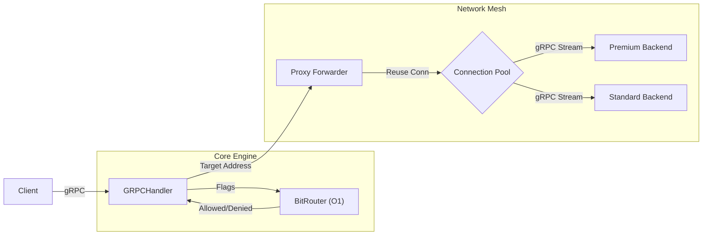

# BitMesh Gateway

.


**BitMesh Gateway** is a high-performance, cloud-native gRPC edge router designed for microservices. It features **O(1) bitwise routing**, **zero-allocation hot paths**, and **thread-safe connection pooling** to handle massive concurrent loads with minimal latency.

Engineered to solve the "Thundering Herd" problem in distributed systems, achieving **44,000+ RPS** with **sub-1.3ms latency** on standard hardware.

---

## 🚀 Key Features

* **Zero-Allocation Routing:** Uses `sync.Pool` to reuse request contexts, eliminating Garbage Collection (GC) pauses on the critical path.
* **TCP Connection Pooling:** Implements a custom `sync.RWMutex` pool with Double-Checked Locking to reuse persistent gRPC connections, eliminating TCP handshake overhead.
* **O(1) Bitwise Logic:** Routes traffic based on binary feature flags (e.g., `0x08` for Premium) using CPU-native bitwise AND operations instead of slow string comparisons.
* **Dynamic Configuration:** Hot-loadable service registry via `config.yaml`—no recompilation needed to change backend targets.
* **Dockerized:** Multi-stage Docker build producing a secure, lightweight (15MB) Alpine image.

---

## 📊 Performance Benchmarks

Benchmarks were conducted using a custom concurrent load generator (included in `cmd/benchmark`) simulating **50 concurrent users** sending **10,000 requests**.

| Environment / Phase | Throughput | Avg Latency | Allocations | Optimization Factor |
| :--- | :--- | :--- | :--- | :--- |
| **Phase 2 (Standard Request)** | ~6,369 req/sec | 7.72 ms | 4 B/op | *Baseline (New Client per Request)* |
| **Phase 3 (Windows 11)** | **21,336 req/sec** | 2.31 ms | **0 B/op** | **3.3x Faster** (Connection Pooling) |
| **Phase 3 (Linux/CachyOS)** | **44,160 req/sec** | **1.12 ms** | **0 B/op** | **7.0x Faster** (Kernel Scheduling) |

> *Benchmarks run on Intel i9-14900K. "Standard Request" represents creating a new gRPC client per request. "BitMesh Pool" utilizes the internal long-lived connection pool. The jump to 44k RPS on Linux demonstrates the impact of the BORE CPU scheduler and reduced syscall overhead compared to Windows.*

---

## 🛠️ Architecture

The system follows a clean "Hexagonal" (Ports & Adapters) architecture:



## 📦 Installation & Usage

### 1. Local Setup
Clone the repository and install dependencies:
```bash
git clone https://github.com/WillDomine/bitmesh-gateway.git
cd bitmesh-gateway
go mod tidy
```

```bash
go run cmd/backend/main.go
# Starts Premium (:50051) and Standard (:50052) services

go run cmd/benchmark/main.go
# Sends sample requests with different feature flags

go run cmd/client/main.go
# Sends sample requests with different feature flags
```

# 1. Build the image
```bash
docker build -t bitmesh-gateway .
```
# 2. Run the container
```bash
docker run --rm --net=host bitmesh-gateway
```
# 3. Run the benchmark
```code blocks
go run cmd/benchmark/main.go
```

## 📂 Project Structure

```text
├── cmd/
│   ├── backend/      # Dummy microservices for testing
│   ├── benchmark/    # High-concurrency load generator
│   └── client/       # CLI test client
├── internal/
│   ├── config/       # YAML configuration loader
│   ├── handler/      # gRPC Interface Layer
│   ├── proxy/        # Network Forwarder + Connection Pool
│   └── router/       # Core Logic (Bitwise ops + sync.Pool)
├── api/
│    ├──proto/        # Protocol Buffer definitions
│    ├──pb/           # Protocol Buffer Compilations 
├── config.yaml       # Dynamic Service Registry
├── Dockerfile        # Multi-stage build definition
├── go.mod            # Go module definition
└── LICENSE           # MIT License
```
